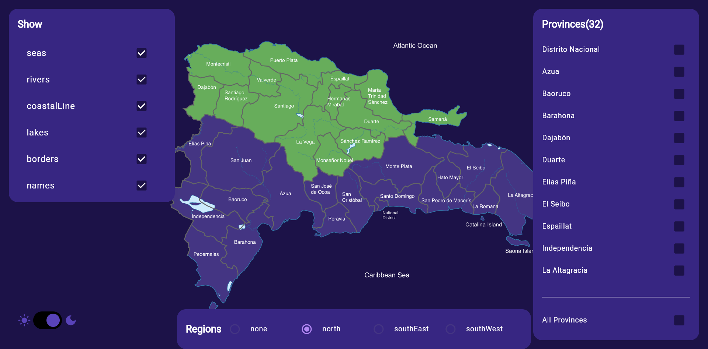
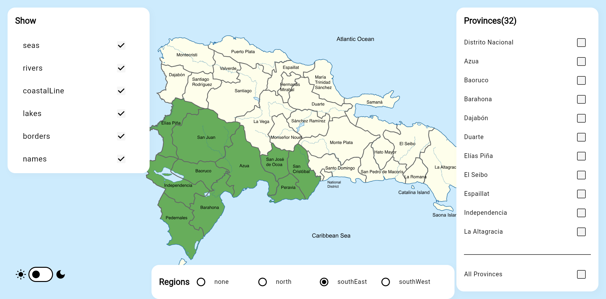
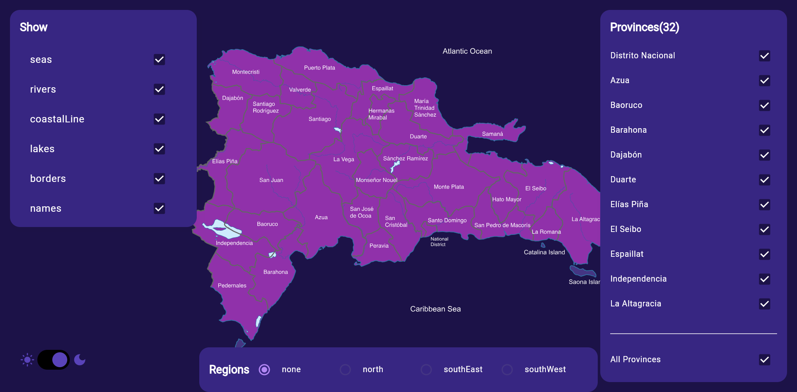

# Riverpod DR Map Explorer

A Flutter showcase project that renders an interactive SVG map of the Dominican Republic, powered by Riverpod for state management and Freezed-based models. The app highlights togglable map layers, region/province filters, and a system-wide theme experience.

## Table of Contents
- [Overview](#overview)
- [Highlights](#highlights)
- [Architecture Snapshot](#architecture-snapshot)
- [System Theme Configuration](#system-theme-configuration)
- [Tech Stack & Packages](#tech-stack--packages)
- [Project Structure](#project-structure)
- [Getting Started](#getting-started)
- [Development Tips](#development-tips)
- [Screenshots](#screenshots)
- [Demo](#demo)
- [License](#license)
- [Disclaimer](#disclaimer)

## Overview
Riverpod DR Map Explorer visualises Dominican Republic provinces with SVG layers and real-time filters. The UI combines draggable/zoomable maps, configurable overlays, and structured province data fetched from a public API. Every major piece of app state (theme, map assets, selected provinces, regions, and remote data) is exposed through Riverpod notifiers so the UI stays reactive and testable.

## Highlights
- Interactive, zoomable map built with `InteractiveViewer` and SVG assets.
- Province selection panel with multi-select checkboxes and "select all" convenience.
- Layer toggles that drive SVG overlays (rivers, coastlines, labels, etc.).
- Region filter that derives colour highlights per geographic area.
- App-wide theme switch that flips between light, dark, and system defaults.
- Province catalogue fetched from https://api.digital.gob.do/v1/territories/provinces using the `http` client.

## Architecture Snapshot
- `lib/main.dart` wires Flutter's `MaterialApp` to Riverpod by wrapping the app in a `ProviderScope` and applying the themed `ThemeData` pair defined in `lib/theme/app_theme.dart`.
- `lib/providers/map_providers.dart` exposes all app state through Riverpod notifiers (`SelectedMapAssets`, `SelectedProvince`, `SelectedMapRegion`, `Provinces`, `AppTheme`). Each notifier handles its own mutations (`updateList`, `toggleTheme`, etc.).
- `lib/models/province.dart` uses Freezed to define the immutable `Province` model and to auto-generate JSON parsing helpers.
- `lib/widgets/` hosts composable UI elements (map, filters, lists, theme toggle) that read/write state via `WidgetRef`.
- SVG assets under `assets/svgs/` drive the visual map layers; `flutter_svg` renders them inside the widget tree.

## System Theme Configuration
The app centralises theme control through the `appThemeProvider`:
- `AppTheme` notifier (in `lib/providers/map_providers.dart`) defaults to `ThemeMode.system` so the UI respects the device preference out of the box.
- `AppTheme.toggleTheme()` lets the UI persist user overrides (light/dark) without leaving the reactive Riverpod ecosystem.
- `lib/theme/app_theme.dart` defines matching `ThemeData` pairs (colour schemes, typography, component themes) so every widget stays consistent when the mode flips.

Extend the provider to cache the user choice (e.g., shared_preferences) if you need persistence across launches.

## Tech Stack & Packages
- **flutter_riverpod / riverpod_annotation / riverpod_generator:** type-safe, annotation-driven state management. Generators build the provider boilerplate so notifiers stay lean.
- **freezed_annotation / freezed:** immutable data modelling for `Province` with union-ready patterns and generated copy/equality helpers.
- **json_annotation / json_serializable:** code-generated (de)serialisation for API payloads.
- **http:** REST client used by `fetchProvinces` to retrieve the live province catalogue.
- **flutter_svg:** renders the multi-layer SVG map assets efficiently on both mobile and web.
- **custom_lint / riverpod_lint:** opt-in lint rules that guard Riverpod best practices and general code health during development.
- **build_runner:** one command to run all code generation passes (Freezed, Riverpod, JSON serialisation) from the terminal.
- **cupertino_icons:** iOS-style icon font available for UI polish.

## Project Structure
```
lib/
  main.dart                 # App entry point with ProviderScope
  models/                   # Freezed models and enums
  pages/                    # High-level screens (DrMapApp)
  providers/                # Riverpod notifiers and generated code
  theme/                    # Light/Dark ThemeData definitions
  widgets/                  # Reusable UI components (map, lists, switch)
assets/
  svgs/                     # Map base layers, provinces, labels, seas
```

## Getting Started
1. **Install prerequisites**
   - Flutter SDK (3.9 or newer matches the specified SDK constraint)
   - An emulator, simulator, physical device, or Chrome for web

2. **Install dependencies**
   ```powershell
   flutter pub get
   ```

3. **Generate code (Freezed, Riverpod, JSON)**
   ```powershell
   flutter pub run build_runner build --delete-conflicting-outputs
   ```

4. **Run the app**
   ```powershell
   flutter run
   ```
   Target Chrome explicitly:
   ```powershell
   flutter run -d chrome
   ```

5. **Run tests**
   ```powershell
   flutter test
   ```

## Development Tips
- Use `SelectedMapAssets`, `SelectedProvince`, and `SelectedMapRegion` providers when wiring new UI controls; they already offer `updateList` and `updateRegion` helpers.
- `fetchProvincesProvider` fetches live data; swap to `mockedProvince` during offline work by overriding the provider in integration tests or add a `ProviderScope` override in `main()`.
- SVG asset names follow the province code (for example, `01.svg`); when adding provinces, drop the asset into `assets/svgs/provinces/` and ensure the code matches the API data.
- The map colours derive from the active `ColorScheme`. Adjust `ThemeData` palettes in `lib/theme/app_theme.dart` to refresh the look globally.

## Screenshots
| Light Theme | Dark Theme |
|-------------|------------|
|  |  |

Additional captures from local runs:




## Demo
[Watch the walkthrough (MP4)](demo.mp4) - short MP4 capture of the app in action.

## License
This project is provided for learning and exploration. Add a license file before distributing or publishing the app.

## Disclaimer
This codebase exists solely for educational exploration and skill improvement; use it at your own discretion in non-production settings.


